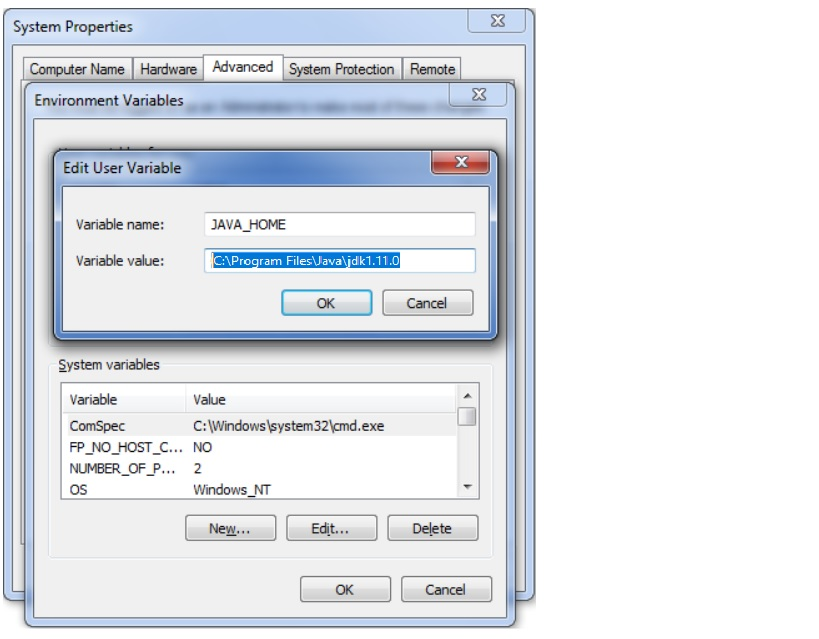
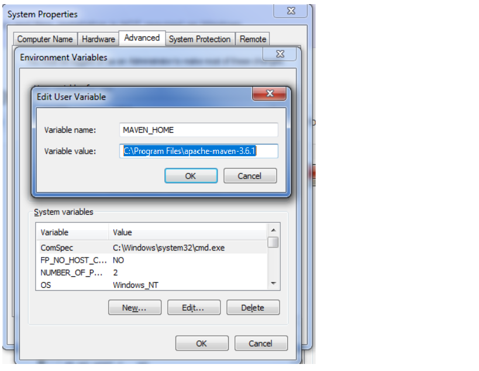
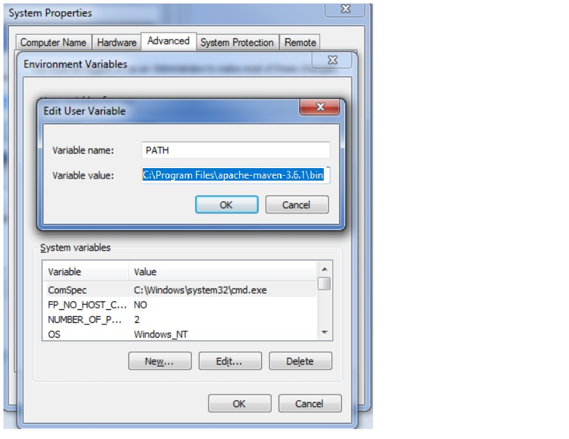
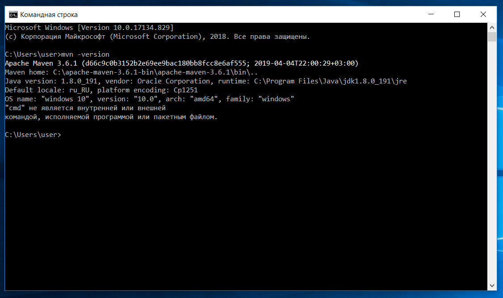
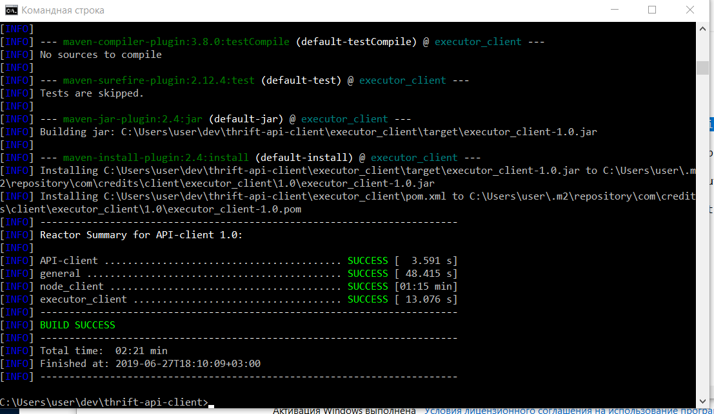
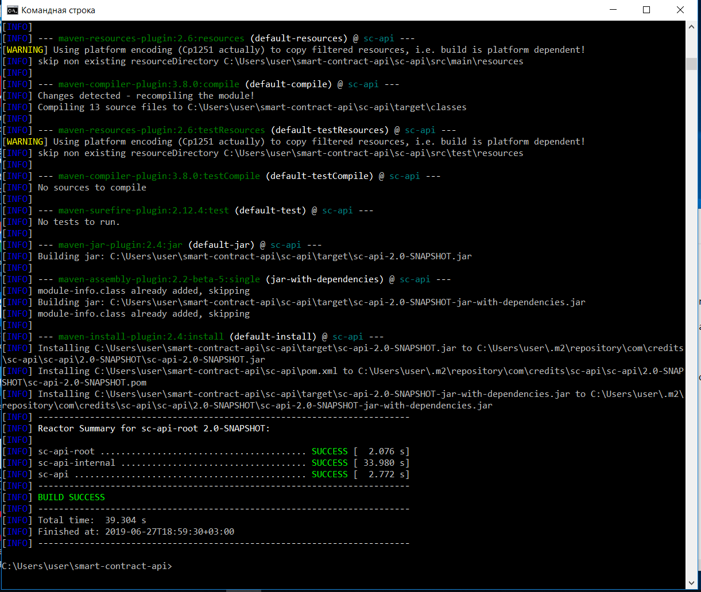
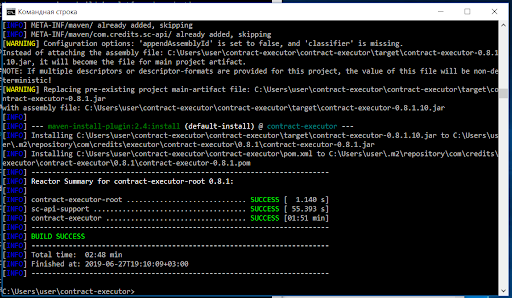

[Documentation](https://developers.credits.com/en/Articles/Platform) \|
[Guides](https://developers.credits.com/en/Articles/Guides) \|
[News](https://credits.com/en/Home/News)

[](https://twitter.com/intent/follow?screen_name=creditscom)
[](contract-executor/LICENSE)
[](http://89.111.33.166:8080/job/ewa//lastBuild/)

## Contract Executor
Contract Executor is app for deploy and execute methods of smart-contract


##### Used environment
- [JDK 11](https://openjdk.java.net/projects/jdk/11/)
- [Maven version 3.6.1](https://maven.apache.org/docs/3.6.1/release-notes.html) 

##### How to build
##### Maven build compilation from sources files for contract-executor

Maven - Is a tool that can be used for building and managing any Java-based project. It is a command-line tool for building Java (and other) programs developed by Apache.

It's up to you to set up your prerequisites and environment to run Maven on Windows. Therefore, the major prerequisite needed is Java SDK installation because Maven is written in Java and primarily it is used to build Java programs.

The installation of Apache Maven implies extracting the archive and adding the bin folder with the mvn command to the PATH.

Detailed steps are:


1. Download and install JDK and Add ‘JAVA_HOME’ Environment Variable. After installing Java you must add JAVA_HOME variable to JDK install folder. In addition, ‘java/bin’ directory must be included in ‘PATH’ variable.

    




2. Download and install Maven and set the ‘M2_HOME’ and ‘MAVEN_HOME’ variables to maven installation folder. You can download Maven [here](https://maven.apache.org/download.cgi).

    




3. Afterward, ‘maven/bin’ directory must be included in ‘PATH’ variable also. To run maven from command prompt, this is necessary so update the PATH variable with 'maven/bin' directory. 

    




4. Check the installation by typing the following command in the console:
``` mvn -version```

    



5. Install [Git](https://git-scm.com/download/win) and clone the thrift-api-client repository from GitHub: [https://github.com/CREDITSCOM/thrift-api-client](https://github.com/CREDITSCOM/thrift-api-client)
6. Change to the directory by using command:_ cd_
7. Once on the directory write the following command in the prompt to build compilation from sources files: 
```mvn clean install```





8. Now, repeat the process for smart-contract-api repository. Clone it from the repository: [https://github.com/CREDITSCOM/smart-contract-api](https://github.com/CREDITSCOM/smart-contract-api)
9. Change to the directory by using command:_ cd. _Then build compilation from sources by using the command: 
```mvn clean install```




10. Finally clone contract-executor repository from: [https://github.com/CREDITSCOM/contract-executor](https://github.com/CREDITSCOM/contract-executor)
11. Change to the contract-executor directory and build it by using: _mvn clean install_. If all the steps were performed properly and secuently, errors won’t be.

    



<h3>Resources</h3>

<a href="https://credits.com//">CREDITS Website</a>

<a href="https://github.com/CREDITSCOM/DOCUMENTATION">Documentation</a>

<a href="https://credits.com/Content/Docs/TechnicalWhitePaperCREDITSEng.pdf">Whitepaper</a>

<a href="https://credits.com/Content/Docs/TechnicalPaperENG.pdf">Technical paper</a>

<a href="https://developers.credits.com/">Developers portal</a>

<a href="http://forum.credits.com/">Credits forum</a>
<h3>Community links</h3>
   <a href="https://t.me/creditscom"></a>
   <a href="https://twitter.com/creditscom"></a>
   <a href="https://www.reddit.com/r/CreditsOfficial/"></a> 
   <a href="https://medium.com/@credits"></a>
   <a href="https://www.instagram.com/credits_com/"></a>
   <a href="https://www.facebook.com/creditscom"></a>
   <a href="https://www.youtube.com/channel/UC7kjX_jgauCqmf_a4fqLGOQ"></a>
